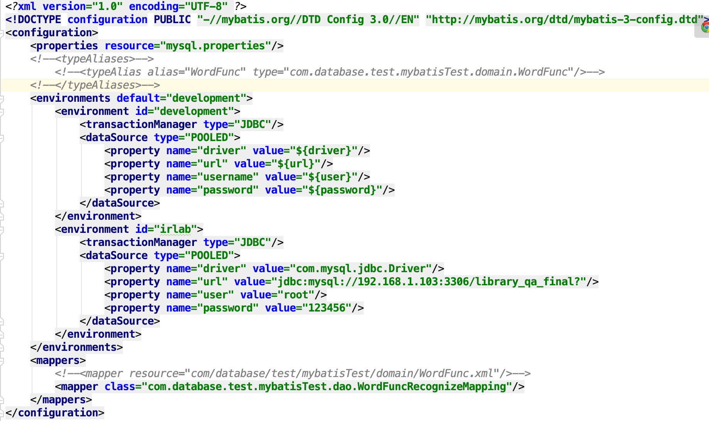
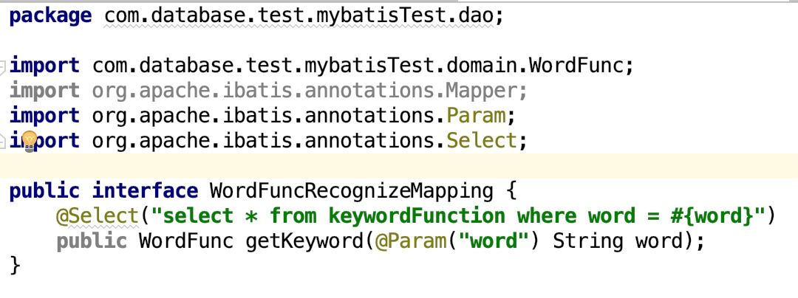
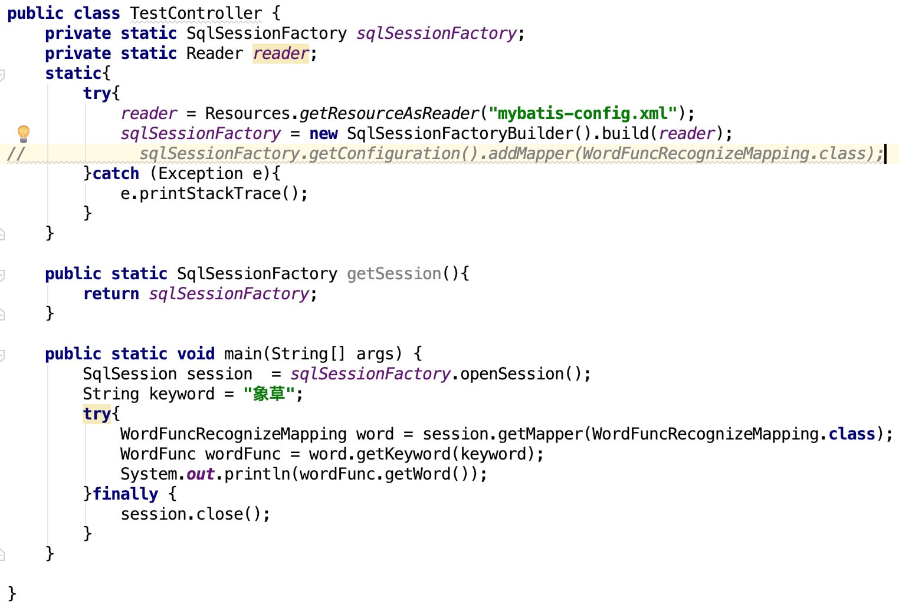
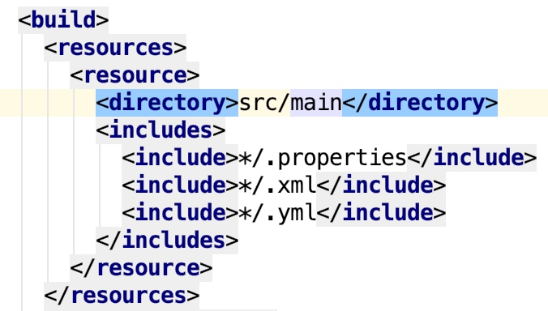

# 用注解形式使用mybatis（非springboot框架）
之前用Mybatis一直都是用的mapper.xml文件，在文件里边写sql语句来进行使用的。这样的方式很繁琐，sql语句也不够直观。之前和师兄交流的时候他提到过在公司基本都用的注解的形式配置，所以想尝试用注解方式来使用MyBatis。当然也遇到了很多坑，在此把流程和坑给记录一下，以后遇到相似问题也可以有个参考。

1. 配置mybatis-config.xml 
  使用Mybatis，首先需要配置mybatis-config.xml。
  文件的内容如下:
  
  需要注意的是，在configuration标签下的子节点是有顺序的。比如，如果将<environment>放到<properties>之前，则会报错：
> org.xml.sax.SAXParseException; lineNumber: 30; columnNumber: 17; 元素类型为 "configuration" 的内容必须匹配"(properties?,settings?,typeAliases?,typeHandlers?,objectFactory?,objectWrapperFactory?,plugins?,environments?,databaseIdProvider?,mappers?)"。
  从报错可以看出，MyBatis的配置文件是有顺序且个数是有限定的，'?'表示可以没有但最多只能有一个。
  在配置文件中，<mappers class="">指定映射接口，即对映射接口的注册。<mappers resource="">指定mapper.xml文件，即用mapper.xml进行操作。<mappers class="">也可以在后续的sqlsession中进行注册，之后会提到。
  
  2. 编写dao类
  在接口类里边，直接用注解的方式写sql语句，该接口类也通过配置文件或者sqlsession进行注册。
  

3.测试类 
在测试类里边用sqlsession的方式来执行sql语句

注释掉的那行即在sqlsessionfactory中对dao类进行注册。
在配置sqlsession的时候遇到了一个坑，即在getResourceAsReader方法中，总是会报找不到源文件的错误。因为是maven项目，所以解决这个错误，需要在pom.xml文件中指定项目的源文件路径，指定之后，java.io就知道在哪里去找源文件了。

